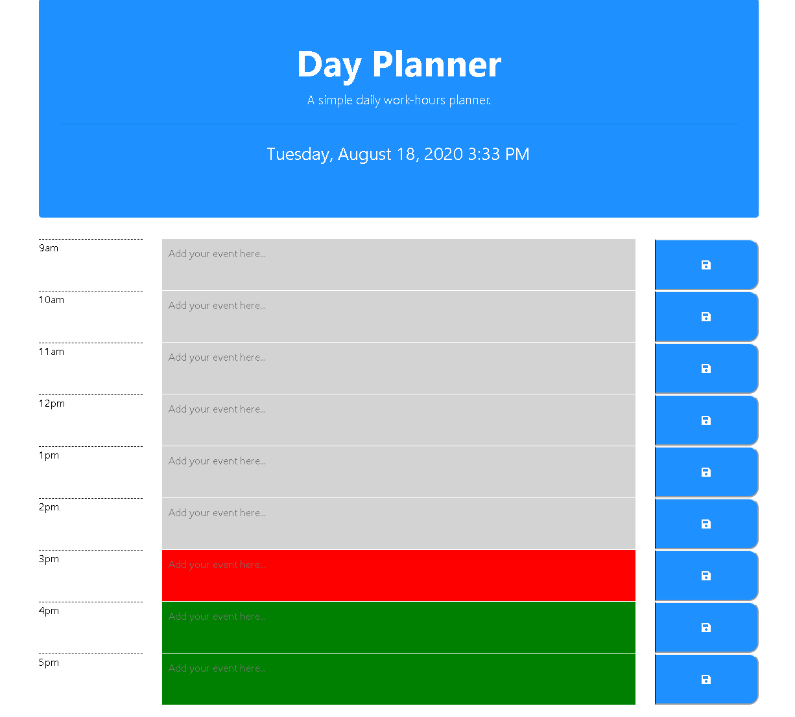

# Day Planner

A simple calendar application that allows the user to save events for each hour of the day.

The app displays standard business hours (9 a.m. to 5 p.m.). Each time slot should represent one hour and contain the following: time, a field to hold user input, a save button.

Clicking on the save button will store the time and user input in `localStorage`.

Near the top of the calendar, the application displays the current day. Additionally, each hour should be color coded to reflect whether the time slot is in the past, the present, or the future. This will change depending on the time of day.

## Purpose of the application

Poor time management can result in missed meetings and deadlines or create the appearance of unprofessionalism. A daily planner allows employees to see their day at a glance, schedule time effectively, and improve productivity.

## Built with

* HTML
* CSS
* jQuery
* MomentsJS
* Bootstrap
