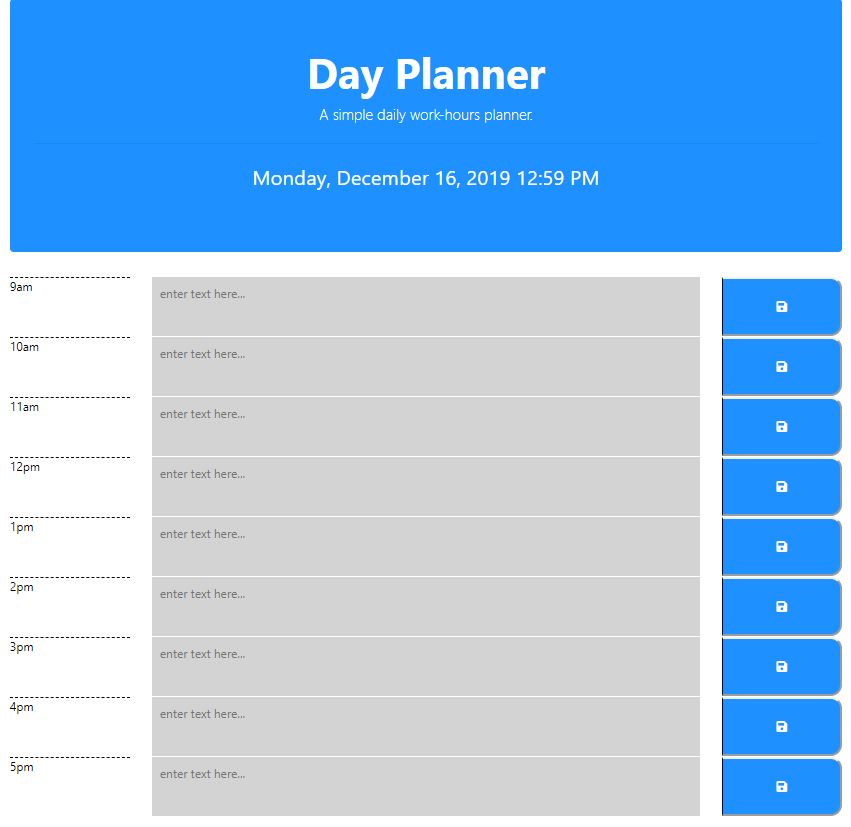

# Day Planner

A simple calendar application that allows the user to save events for each hour of the day. 

## Built with

    HTML 
    CSS 
    jQuery and 
    MomentsJS
    Bootstrap

## The APP

The app displays standard business hours (9 a.m. to 5 p.m.). Each time slot should represent one hour and contain the following: time, a field to hold user input, a save button.

    Clicking on the save button will store the time and user input in `localStorage`.

Near the top of the calendar, the application displays the current day. Additionally, each hour should be color coded to reflect whether the time slot is in the past, the present, or the future. This will change depending on the time of day.

## Purpose of the application

Poor time management can result in missed meetings and deadlines or create the appearance of unprofessionalism. A daily planner allows employees to see their day at a glance, schedule time effectively, and improve productivity. 

## Repos

[https://github.com/yourname/darh0ky](https://github.com/darh0ky/)

## Deployment

[https://darh0ky.github.io/Daily-Planner/](https://darh0ky.github.io/Daily-Planner/)

## License

The MIT License (MIT)

Copyright (c) 2015 Chris Kibble

Permission is hereby granted, free of charge, to any person obtaining a copy of this software and associated documentation files (the "Software"), to deal in the Software without restriction, including without limitation the rights to use, copy, modify, merge, publish, distribute, sublicense, and/or sell copies of the Software, and to permit persons to whom the Software is furnished to do so, subject to the following conditions:

The above copyright notice and this permission notice shall be included in all copies or substantial portions of the Software.

THE SOFTWARE IS PROVIDED "AS IS", WITHOUT WARRANTY OF ANY KIND, EXPRESS OR IMPLIED, INCLUDING BUT NOT LIMITED TO THE WARRANTIES OF MERCHANTABILITY, FITNESS FOR A PARTICULAR PURPOSE AND NONINFRINGEMENT. IN NO EVENT SHALL THE AUTHORS OR COPYRIGHT HOLDERS BE LIABLE FOR ANY CLAIM, DAMAGES OR OTHER LIABILITY, WHETHER IN AN ACTION OF CONTRACT, TORT OR OTHERWISE, ARISING FROM, OUT OF OR IN CONNECTION WITH THE SOFTWARE OR THE USE OR OTHER DEALINGS IN THE SOFTWARE.